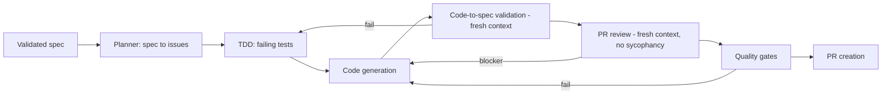

# Workbench Plugin: Build Instructions for Claude Code

**Audience:** Claude Code, running as the builder, with a human engineer supervising.
**Goal:** Build a Claude Code plugin named `workbench` that standardizes how the Mastercard Australia cohort specs, tests, builds, reviews and ships, and that also powers the Learning Labs (journey capture and grading).
**Scope:** A simple, 5-skill plugin plus supporting subagents, hooks, rules, commands and docs. Keep it small and sharp. Everything is authored for Claude Code and distributed as a plugin through a private marketplace.

> **Before you start (CLI reconciliation).** Plugin, subagent, hook, workflow and marketplace schemas change between Claude Code releases. Run `claude --version`, then check `claude plugin --help`, `claude plugin validate`, and the installed docs for the exact file names and JSON keys. Where this document shows a schema, treat it as the intended shape and adjust field names to match the installed CLI. Do not invent capabilities the installed version does not have; if a feature (for example native "workflows") is not present, fall back to the documented alternative noted in that section.

---

## 1. Principles to encode

These are the design rules every skill and subagent must honor. Put them in `rules/` and reference them from each `SKILL.md`.

1. **Spec first.** No code is generated without a validated spec. Payments work is spec-first by nature.
2. **Fresh context for judgment.** Any step that judges work (code-to-spec validation, PR review) runs in a separate subagent with clean context. The reviewer must not be the same context that wrote the code, so it critiques the output instead of defending it. This is the anti-sycophancy rule.
3. **Python load-bearing.** Deterministic work (git, file I/O, diff parsing, coverage math, template checks, issue creation, formatting) is done in Python, not by the model. This saves tokens and makes runs repeatable. The model does synthesis and judgment only.
4. **Developer stays the decision-maker.** Every stage has a human-visible gate. The plugin proposes; the engineer approves.
5. **Governed by default.** Guardrails, an audit trail, and a use policy are on from the first run.
6. **Composability and contribution.** Skills are small and single-purpose. Adding a new skill or rule is a documented, low-friction PR.

---

## 2. Target layout

Build this exact structure. Names in `${...}` are placeholders to confirm with the team.

```
workbench/
  .claude-plugin/
    plugin.json                 # plugin manifest
  commands/                     # slash commands (thin entry points)
    spec.md
    test-strategy.md
    build.md
    review.md
    grade.md
  skills/
    spec-craft/
      SKILL.md
      scripts/                  # python load-bearing helpers
    sdet-architect/
      SKILL.md
      scripts/
    work-orchestrator/
      SKILL.md
      workflow.yaml             # the pipeline definition (see CLI note)
      scripts/
    journey-recorder/
      SKILL.md
      scripts/
    lab-grader/
      SKILL.md
      rubric.yaml
      scripts/
  agents/                       # subagents used for fresh-context stages
    planner.md
    code-to-spec-validator.md
    pr-reviewer.md
  hooks/
    hooks.json
    journey_record.py
    quality_gates.py
  rules/
    coding-standards.md
    ai-use-policy.md
    spec-template.md
  scripts/
    lib/                        # shared python used across skills
  docs/
    ARCHITECTURE.md
    EXTENDING.md                # how to add skills and capabilities
  README.md
```

A separate, tiny repo holds the marketplace:

```
mastercard-workbench-marketplace/
  .claude-plugin/
    marketplace.json
```

---

## 3. Manifest and marketplace

### 3.1 `workbench/.claude-plugin/plugin.json`
Create the manifest. Confirm keys against the installed CLI; the intended shape is:

```json
{
  "name": "workbench",
  "version": "0.1.0",
  "description": "Mastercard AU engineering workbench: standardized spec, test, build, review and ship for Claude Code.",
  "author": "Arula.AI / InRhythm",
  "keywords": ["spec-driven", "sdet", "tdd", "governance", "payments"],
  "commands": "./commands",
  "agents": "./agents",
  "hooks": "./hooks/hooks.json",
  "skills": "./skills"
}
```

If the installed CLI auto-discovers `commands/`, `agents/`, `skills/` and `hooks/` by convention, omit the explicit paths and rely on discovery. Validate with `claude plugin validate ./workbench`.

### 3.2 Marketplace
Create `mastercard-workbench-marketplace/.claude-plugin/marketplace.json`:

```json
{
  "name": "mastercard-workbench",
  "owner": "Mastercard AU (private)",
  "plugins": [
    { "name": "workbench", "source": "../workbench", "description": "Engineering workbench plugin" }
  ]
}
```

Install path for users: add the marketplace, then install `workbench`. Confirm the exact commands with `claude plugin marketplace --help` (intended: `claude plugin marketplace add <git-url>` then `claude plugin install workbench@mastercard-workbench`).

### 3.3 Superpowers dependency
`spec-craft` builds on the **superpowers** plugin's brainstorm to design to plan discipline. Decide one of two integration modes and record it in `docs/ARCHITECTURE.md`:
- **Companion install (preferred):** require the `superpowers` plugin alongside `workbench`; `spec-craft` invokes its brainstorming and planning skills, then formats the result into the Mastercard spec template.
- **Vendored patterns:** if a third-party plugin cannot be installed in the environment, re-implement the specific superpowers patterns you use inside `spec-craft/scripts` and credit them in `EXTENDING.md`. Do not copy licensed content; re-express the workflow.

---

## 4. The skills

Build these five skills. Each `SKILL.md` needs YAML frontmatter (`name`, `description` with clear trigger language) and a body with: purpose, inputs, steps, python-load-bearing parts, subagents used, outputs, and acceptance criteria. Keep each skill single-purpose.

### 4.1 `spec-craft`: standardize spec creation (with superpowers)
- **Purpose:** turn an intent plus context into a validated, standardized spec the team trusts.
- **Trigger / command:** `/spec`.
- **Inputs:** a short problem statement, links or notes on the relevant ISO message types and API contracts, and the team's non-negotiables.
- **Steps:**
  1. Run the superpowers brainstorm and design pass to pressure-test the intent (or the vendored equivalent).
  2. Draft the spec into `rules/spec-template.md` structure (context, scope, interfaces, data, acceptance criteria, non-negotiables, risks).
  3. **spec-validate:** check the draft against the template and the product vision. Python does the structural checks (required sections present, acceptance criteria testable, IDs resolvable); the model judges completeness and clarity.
  4. Emit a "ready to work" summary and stop for the human gate.
- **Python load-bearing:** template conformance, link and ID resolution, acceptance-criteria linter.
- **Outputs:** `spec.md` plus a `spec.status.json` (valid / gaps).
- **Acceptance:** a spec that fails a required section or has a non-testable acceptance criterion is reported as not ready, with the specific gaps listed.

### 4.2 `sdet-architect`: SDET architecture and test building
- **Purpose:** define the testing strategy for the spec, then build the tests.
- **Trigger / commands:** `/test-strategy`, `/build-tests`.
- **Inputs:** a validated spec, the repo's stack and existing test setup.
- **Steps:**
  1. Propose a test architecture: unit, contract, integration, and where emulators sit; coverage targets; what runs locally vs in CI.
  2. Generate the failing tests first (TDD) from the acceptance criteria.
  3. Provide a `test-maintainer` routine that finds tests broken by a change, proposes fixes, and flags missing coverage.
- **Python load-bearing:** coverage math, test discovery, mapping acceptance criteria to test files, diff-to-broken-test analysis.
- **Outputs:** a test plan document and generated test files; a coverage baseline.
- **Acceptance:** every acceptance criterion in the spec maps to at least one test; the strategy names the emulator and contract boundaries.

### 4.3 `work-orchestrator`: the development pipeline
This is the centerpiece. It runs the full path from a validated spec to a created PR, as a **workflow**, spawning fresh-context subagents for the judgment stages.

- **Purpose:** take a validated spec and drive it to a reviewed, gated PR with the developer in control at each gate.
- **Trigger / command:** `/build`.
- **Pipeline (define in `skills/work-orchestrator/workflow.yaml`):**
  1. **Plan (planner subagent):** break the spec into a small ordered set of issues / subspecs. Python writes them to `issues.json` (and optionally opens tracker issues). Each issue carries its own acceptance criteria.
  2. **Per issue, in order:**
     a. **TDD:** pull in `sdet-architect` to write failing tests for the issue.
     b. **Code generation:** implement until the issue's tests pass. Python runs the test commands; the model edits code.
     c. **Code-to-spec validation (fresh context):** spawn the `code-to-spec-validator` subagent with only the spec, the issue, and the diff. It scores the change against the spec and the five failure modes. It never sees the building context.
     d. **PR review (fresh context):** spawn the `pr-reviewer` subagent with only the diff and the standards. It reviews as a skeptical reviewer, not the author. No sycophancy.
     e. **Quality gates:** run `hooks/quality_gates.py` (lint, security scan, coverage threshold, secret scan). A failed gate stops the issue and reports why.
     f. **PR creation:** on passing gates plus human approval, Python opens the PR with the spec link, the validator and reviewer notes, and the gate results attached.
- **Fresh-context rule:** stages c and d must run as separate subagents. If the installed CLI cannot spawn subagents from a workflow, run each as its own `claude` invocation with a minimal prompt and the diff piped in; document the fallback.
- **Workflows note:** if the installed CLI has a native workflow feature, express the pipeline there. If not, implement the sequence in `scripts/orchestrate.py`, which calls the CLI for each model stage and Python for each deterministic stage. Either way, keep the stage boundaries identical.
- **Python load-bearing:** issue file management, running tests and gates, diff extraction, git and PR operations, assembling the PR body.
- **Outputs:** a PR per issue (or per spec, team's choice), with an auditable trail.
- **Acceptance:** no PR is created if code-to-spec validation fails, PR review flags a blocker, or any quality gate fails. The developer can override with a recorded reason.

### 4.4 `journey-recorder`: capture the lab journey
- **Purpose:** record what a learner did in a lab (prompts, decisions, artifacts, gate results) for playback and grading.
- **Mechanism:** a hook (see section 5) plus a small skill to start, stop and export a session.
- **Trigger / command:** `/journey start|stop|export`.
- **Python load-bearing:** append-only event log per session, redaction of anything sensitive, export to a single file.
- **Outputs:** `journey/<session>.jsonl` and a readable `journey/<session>.md`.
- **Acceptance:** a completed lab produces a journey file that shows each stage the learner passed through and the decisions they made.

### 4.5 `lab-grader`: grade a lab against a rubric
- **Purpose:** score a learner's lab run against the objectives, and produce feedback plus a cohort-level roll-up.
- **Trigger / command:** `/grade`.
- **Inputs:** a journey file and the lab's `rubric.yaml` (for example: caught each failure mode by hand, gated the spec, added contract tests, passed the quality gates).
- **Steps:** Python scores the objective, measurable items from the journey log; the model writes the qualitative feedback.
- **Outputs:** a per-learner grade card and an anonymized cohort summary that feeds the baseline and the readout.
- **Acceptance:** grading is reproducible from the journey file; the same input yields the same score.

---

### 4.6 CI-agentic skills (authored by the cohort in Lab 4)
The plugin grows three more skills that run Claude agentically in CI (GitHub Actions), not just interactively. Ship stubs or leave clear extension points; the cohort completes them in Lab 4.
- **`red-team-review`:** scheduled and on-demand deep security and payments red-team review of a repo; posts findings.
- **`test-maintainer`:** on every pull request, finds tests broken by the change, proposes minimal fixes in a follow-up PR, and flags missing coverage.
- **`release-risk-scorer`:** on pull requests to a release branch, scores payment-grade release risk (authorization, holds, PAN paths, downstream contracts) and blocks above a threshold as a required check.

These reuse the shared python layer (section 4.8) and demonstrate the three skill types: skill-first, python load-bearing, and hybrid.

---

## 5. Subagents, hooks, commands, rules

### 5.1 Subagents (`agents/`)
Each subagent is a focused reviewer with its own context.
- `planner.md`: input a spec, output an ordered issue list with per-issue acceptance criteria. Small, deterministic prompts.
- `code-to-spec-validator.md`: input the spec, the issue and the diff only. Output a pass or fail with reasons, checked against the spec and the five failure modes.
- `pr-reviewer.md`: input the diff and `rules/coding-standards.md` only. Output review comments as a skeptical reviewer. Explicitly instruct it that it is not the author and must not soften findings.

### 5.2 Hooks (`hooks/hooks.json` plus python)
- `journey_record.py`: fires on the relevant Claude Code events to append to the session journey. Confirm the available hook event names in the installed CLI and wire to the closest equivalents (session start, tool use, stop).
- `quality_gates.py`: runs lint, security scan, secret scan, and a coverage threshold. Returns nonzero on failure so the orchestrator halts. Reusable in CI.

### 5.3 Commands (`commands/`)
Thin entry points that call the matching skill: `spec.md`, `test-strategy.md`, `build.md`, `review.md`, `grade.md`. Keep logic in the skills, not the commands.

### 5.4 Rules (`rules/`)
- `coding-standards.md`: the review bar the `pr-reviewer` uses.
- `ai-use-policy.md`: governance and use policy, on by default.
- `spec-template.md`: the canonical spec shape `spec-craft` enforces.

---

## 6. The pipeline, at a glance



Plain-language version for anyone whose viewer does not render the diagram: a validated spec goes to the planner, which breaks it into issues. For each issue: write failing tests, generate code to pass them, validate the change against the spec in a fresh context, review the PR in a second fresh context, run the quality gates, and only then create the PR. Any failure sends the issue back to the relevant earlier stage.

---

## 7. Build order for Claude Code

1. Confirm CLI capabilities (section top note). Record findings in `docs/ARCHITECTURE.md`.
2. Scaffold the repo layout in section 2. Create `plugin.json` and validate it.
3. Write `rules/` (coding standards, AI use policy, spec template).
4. Build `spec-craft`, then `sdet-architect`. These are usable on their own.
5. Build the subagents (`planner`, `code-to-spec-validator`, `pr-reviewer`).
6. Build `work-orchestrator` and its `workflow.yaml` (or `scripts/orchestrate.py` fallback). Wire in the subagents and `quality_gates.py`.
7. Build the hooks and confirm event wiring.
8. Build `journey-recorder`, then `lab-grader` with a starter `rubric.yaml`.
9. Write `commands/` entry points.
10. Write `docs/EXTENDING.md` (section 8).
11. Create the marketplace repo and publish `0.1.0`. Install it in a scratch project and run the verification in section 9.

---

## 8. `docs/EXTENDING.md` (how to add skills and capabilities)

Write a short contributor guide that covers:
- **Skill types:** skill-first (model does the work), hybrid (model plus python), and python load-bearing (python does the deterministic heavy lift, model returns a tight structured result). Give one worked example of each.
- **Anatomy:** where a new skill lives (`skills/<name>/SKILL.md` plus `scripts/`), the frontmatter fields, and how the description drives triggering.
- **Adding a subagent, hook, command or rule:** the file to add and the manifest or `hooks.json` entry to update.
- **The contribution loop:** branch, add the skill, run `claude plugin validate`, open a PR to the workbench repo, bump the version, publish to the marketplace, and let teammates sync. Personal overrides live in the user's own `~/.claude` and never break the shared build.
- **Keep it small:** one skill, one job. If a skill needs a fresh-context judgment, add a subagent rather than folding it into the skill.

---

## 4.7 Use every Claude Code plugin capability
The workbench is meant to exercise the whole plugin surface, so nothing is left on the table. Map each capability to a concrete piece:
- **Skills:** `spec-craft`, `sdet-architect`, `work-orchestrator`, `journey-recorder`, `lab-grader`, plus the Lab 4 additions `red-team-review`, `test-maintainer`, `release-risk-scorer`.
- **Subagents:** `planner`, `code-to-spec-validator`, `pr-reviewer`, and a `clean-room-judge` for fresh-context scoring.
- **Slash commands:** `/spec`, `/test-strategy`, `/build`, `/review`, `/grade`, `/hand-off`, and `/lab`.
- **Hooks:** `journey_record` (session and tool events) and `quality_gates` (pre-PR and in CI).
- **Rules:** `coding-standards`, `ai-use-policy`, `payments-guardrails`, `spec-template`, auto-loaded as governance.
- **MCP servers (optional, least-privilege):** wire a read-only tracker or a ledger or fraud emulator MCP where a skill genuinely benefits; keep it optional.
- **Settings:** default model, permissions, and which hooks are enabled per repo via `.claude/settings.json`.
- **Marketplace:** private distribution, versioning, team sync, and personal overrides in the user's own config.
- **Lab-runner:** a `/lab` command plus per-lab `.claude/lab.json` and rubric files, so the four labs are delivered entirely by the plugin. The cohort needs only Claude Code plus the workbench.

## 4.8 Shared python scripts and references
Put reusable, deterministic helpers in `scripts/lib/` and shared content in `references/` so skills compose instead of duplicating logic:
- **`scripts/lib/`:** git and diff, test-run and failure-parse, coverage-delta, PR and check-run, spec-template checks, and PAN and secret scanners.
- **`references/`:** the payments review checklist, PAN and secret patterns, ISO message field maps, the risk-weight table, and the spec template.
Every skill imports from `scripts/lib` and reads from `references`. This is the python-load-bearing layer: the model calls these for determinism and token savings and returns tight structured results. Document it in `docs/EXTENDING.md` and review changes to it like any other change.

---

## 9. Verification (acceptance run)

In a scratch repo with a small sample service:
1. `/spec` on a toy payments change produces a spec that fails validation when a section or acceptance criterion is missing, and passes when complete.
2. `/build` breaks the spec into issues, writes failing tests, generates code, and then **blocks PR creation** when you seed a deliberate spec mismatch (validator catches it) and when you seed a standards violation (reviewer catches it). Confirm the validator and reviewer ran as separate contexts.
3. Quality gates fail the run on an intentional lint or secret violation.
4. A lab run yields a journey file, and `/grade` produces the same score twice on the same journey.
5. Add a trivial new skill following `EXTENDING.md`, validate, and confirm it loads.

Ship `0.1.0` only when all five pass.

---

## 10. Open items to confirm with the team

- Plugin and marketplace names, and where the private marketplace is hosted.
- Superpowers integration mode (companion install vs vendored patterns) and version pin.
- Whether PRs are one-per-issue or one-per-spec.
- Tracker for issues (local `issues.json` only, or also open issues in the team's tracker).
- Exact CLI version to target, so the workflow, hook and manifest schemas are pinned.

---

## Appendix: mapping to the four labs

- **Lab 1 (Foundations, governance, five failure modes):** install the plugin; use the governance rules, the audit trail, and the quality-gate and journey-recorder hooks.
- **Lab 2 (Spec to trusted build):** `spec-craft` and the `work-orchestrator` planner plus TDD and code-to-spec validation.
- **Lab 3 (Confidence past TDD):** `sdet-architect`, the fresh-context validator and reviewer, and the quality gates.
- **Lab 4 (Extend the workbench):** author a new skill, rule, hook or subagent using `EXTENDING.md`, publish, and sync.

`journey-recorder` and `lab-grader` run across all four labs as the lab infrastructure.
